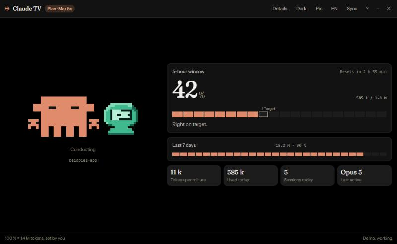

# Claude TV

**[English](README.md)** · Deutsch



Ein kleines Desktop-Programm, das zeigt, wie viel du gerade in Claude Code
verbrauchst. Mit Clawd, dem Pixelmaskottchen: es schläft, wenn du Pause machst,
tippt am Laptop, wenn es läuft, setzt beim Warten die Sonnenbrille auf,
schwitzt im Sprint und liegt platt am Anschlag. Daneben steht ein kleiner
Rechner, dessen Bildschirm den Zustand mitzeichnet.

Gestaltung als Mischung mit klarer Aufgabenteilung: Pixel für Maskottchen und
Grafiken, Serif für die großen Zahlen, Sans für die Texte.

Läuft rein lokal. Kein Server, kein Konto, kein offener Port, keine Anfrage ins
Netz. Das Programm liest ausschließlich Dateien, die auf deiner Platte sowieso
schon liegen.

## Was es zeigt

**Übersicht**

* das laufende 5-Stunden-Fenster in Prozent, mit Countdown bis zum Reset
* eine **Marke „Uhr"** über dem Balken: der Balken zeigt den Verbrauch, die
  Marke zeigt, wie viel Zeit des Fensters schon vorbei ist. Balken links von der
  Marke heißt Luft, rechts davon heißt zu schnell.
* daraus eine Klartextzeile: `56 % Reserve gegenüber der Uhr`, `Genau im Takt
  der Uhr` oder `In diesem Tempo bei 100 % in 19 Min.`
* die letzten 7 Tage, Tokens pro Minute, Verbrauch heute, Sitzungen heute und
  das zuletzt genutzte Modell
* deinen Tarif, gelesen aus der Claude-Code-Konfiguration

**Details**

* **Woraus der Verbrauch besteht**: ein gestapelter Balken mit Legende, also
  Eingabe, Antwort, Denken und neu angelegter Cache, jede Zeile mit einer
  kurzen Erklärung. Wiederverwendeter Cache steht getrennt darunter.
* **Wohin der Verbrauch geht**: Hauptlauf, Subagenten und Workflows getrennt.
  Die Zahl überrascht die meisten, am eigenen Bestand gemessen ging gut die
  Hälfte an Subagenten.
* **Fenster im Vergleich**: die letzten vierzehn abgeschlossenen Fenster als
  Reihe, das laufende rechts abgesetzt. Ohne diesen Vergleich sagt eine
  Prozentzahl wenig.
* **Die Woche** als sieben Tagesbalken
* **Cache-Wiederverwendung** insgesamt und im laufenden Fenster. Hoch ist gut:
  gelesener Cache kostet fast nichts, neu angelegter zählt voll.
* **Größte Sitzungen heute**, ohne Subagenten, damit die Namen zuzuordnen sind
* **Über die API gerechnet**: was dieselbe Nutzung zu Listenpreisen gekostet
  hätte, für Fenster, Tag und Woche
* **Wann du arbeitest**: Wochentag mal Stunde über vier Wochen
* Verbrauch pro Modell und pro Projekt
* Verlauf im laufenden Fenster und über den Tag

Ab etwa 1000 mal 820 Punkten Fenstergröße stehen Übersicht und Details
untereinander, das Umschalten entfällt dann.

**Woran gearbeitet wird** steht unter der Figur und als eigene Karte in den
Details: Projekt, laufendes Werkzeug, die letzten Schritte mit Uhrzeit, die
zuletzt angefassten Dateien. Dazu der Zustand des Repositories — Branch,
geänderte und neue Dateien, Vorsprung oder Rückstand zum Remote, letzter
Commit. Das liest `git` lokal im Projektordner, ohne Token und ohne GitHub.
Wer das nicht will, schaltet es im Tray-Menü ab; dann wird kein `git`
aufgerufen.

**Im Tray** neben der Uhr sitzt Clawd noch einmal klein und bewegt sich mit.
Linksklick zeigt und versteckt das Fenster, Rechtsklick öffnet ein Menü, der
Mauszeiger darüber nennt Prozent und Resetzeit. Schließen legt das Fenster ins
Tray, statt das Programm zu beenden; beenden geht über das Tray-Menü.

**Autostart** ist nach der Installation an. Das Programm meldet sich bei
Windows an, startet still ins Tray und wartet 60 Sekunden, bevor es das erste
Mal die Logs liest, damit es die Anmeldung nicht ausbremst. Abschalten mit
einem Klick im Tray-Menü.

**Taste `H`** erklärt jede Zahl in einem Satz. Wenn irgendwo unklar ist, was
etwas bedeutet, steht die Antwort dort.

## Was es nicht kann

Fünf Dinge vorweg, damit die Anzeige nicht mehr verspricht, als sie hält:

**Deine Chats auf claude.ai sind unsichtbar.** In den Logs steht nur Claude
Code. Alles, was du im Browser oder in der Desktop-App mit Claude machst, fehlt.

**Echte Limit-Prozente gibt es lokal nicht, aber du kannst sie einmal
einfügen.** Im Kontextfenster von Claude Code führt „Detaillierte
Aufschlüsselung anzeigen" zu einem kopierbaren Bericht mit den echten Werten.
Taste `A` öffnet in Claude TV das Abgleichfenster; aus dem eingefügten Text
liest die Anzeige die echten Fenstergrenzen und rechnet aus dem Prozentwert
aus, wie viel 100 Prozent wirklich sind.

**Die Anzeige zählt vom abgelesenen Wert weiter.** Liegt der Abgleich im
laufenden Fenster, ist sein Prozentwert keine Schätzung, sondern abgelesen. Die
Anzeige beginnt dort und rechnet nur noch dazu, was seither gemessen wurde.
Ohne diese Regel teilt sie stur durch das ausgeglichene Budget: am 02.10.2026
ergab das 64 Prozent, abgelesen waren 57. Mit der Regel: 57.

**Mehrere Abgleiche sind besser als einer.** Der Bericht nennt volle Prozent,
darin steckt schon Rundung, und dazu kommt Verbrauch, den die Logs nicht sehen.
Drei Punkte desselben Fensters am 09.09.2026 ergaben einzeln 6,78 M, 7,40 M und
6,98 M als 100-Prozent-Marke. Gemeinsam ausgeglichen, über kleinste Quadrate,
sind es 7,05 M, und damit lag die Anzeige an allen drei Stellen höchstens drei
Punkte daneben statt fünf. Jeder eingefügte Bericht kommt als Punkt dazu,
Punkte älter als vier Wochen fallen raus.

Das Alter zählt dabei mit, denn die Grenze selbst wandert: dieselbe Rechnung
ergab am 09.09. 7,40 M, am 15.09. 9,93 M und am 02.10. 10,88 M, über drei
Wochen stetig steigend. Nach einer Woche zählt ein Punkt deshalb noch halb,
nach drei Wochen noch ein Achtel.

Ohne Abgleich bleibt es bei der Schätzung unten.

**Ohne Abgleich ist die Skala geschätzt.** Claude Code kennt sie, holt sie
aber live von der API und schreibt sie nirgends auf die Platte. Nachgesehen
wurde in `~/.claude/`, in `~/.claude.json` samt Sicherungen und in den
Session-Logs: dort stehen Tarif und Tokenzahlen, aber keine Auslastung und keine
Resetzeiten. Nachkontrolliert am 09.09.2026, unverändert. Das einzige Feld mit
Limitbezug außerhalb der Logs ist `rateLimitTier` in `.credentials.json`, also
wieder nur der Tarifname; die Datei bleibt ungelesen. Deshalb ist die Skala selbstkalibrierend: 100 % ist dein eigenes
p90-Fenster, also der Wert, den 9 von 10 deiner abgeschlossenen Fenster nicht
überschreiten. Die Fußzeile schreibt immer hin, was gerade als 100 % gilt.
Solange weniger als drei Fenster gemessen sind, gibt es gar keine Prozente,
sondern nur absolute Zahlen.

**Der Fensteranfang kann ohne Abgleich danebenliegen.** Am 02.10.2026 stand
die erste lokale Logzeile um 12:45:37, das Fenster lief laut Bericht aber schon
ab 12:30. Geöffnet hat es also etwas, das die Logs nicht sehen. Mit Abgleich
oder Limit-Meldung steht die Grenze fest, ohne beides bleibt sie geschätzt.

**Ohne Abgleich schätzt die Anzeige den Anfang.** Die App beginnt ein
Fenster dann mit der ersten Nachricht, abgerundet auf die volle Stunde. Anthropic setzt den
Anfang aber dorthin, wo dein voriges Fenster ausgelaufen ist, und das kann eine
Uhrzeit sein, an der lokal nichts passiert ist. Gemessen am 09.09.2026: die App
begann das Fenster um 12:52, Claude Code meldete Reset um 19:00, also Anfang
14:00. Der Verbrauch dazwischen zählt bei Anthropic ins vorige Fenster, in der App ins
laufende. Der Grund: der Anfang hängt am Kontostand, und Verbrauch aus dem
Browser sieht die App nie. Genau dagegen hilft der Abgleich, denn der Bericht
nennt die echte Resetzeit; danach liegt das Raster fest.

**Das zweite Wochenlimit bleibt fremd.** Der Bericht nennt es, nachrechnen
lässt es sich nicht: am 09.09.2026 stand es auf 0 %, während im selben Zeitraum
39,2 M Fable-Tokens in den Logs lagen. Die Anzeige zeigt deshalb nur den Wert
aus dem letzten Abgleich und schreibt dazu, wie alt er ist.

**Die Anzeige springt pro Nachricht, nicht pro Token.** Claude Code schreibt
seine Logs, wenn eine Nachricht fertig ist. Genau dieser Moment löst auch den
Partikelstoß zur Figur aus.

## Loslegen

Gebraucht wird Node 18 oder neuer. Einmalig:

```bash
npm install
```

Zum Ausprobieren:

```bash
npm start
```

Fertige Programme bauen:

```bash
npm run dist
```

Danach liegen drei Dateien in `dist/`:

| Datei | wofür |
| --- | --- |
| `Claude TV Setup.exe` | Installer für x64 **und** ARM64 in einer Datei, er wählt beim Installieren selbst. Doppelklick, kein Administrator nötig. Legt die App unter `%LOCALAPPDATA%\Programs\Claude TV` ab, dazu Verknüpfungen auf Desktop und im Startmenü, und trägt sich unter Apps zum Deinstallieren ein. |
| `Claude TV arm64.zip` | für ARM64-Windows ohne Installation. Auspacken, `Claude TV.exe` starten. Der geprüfte Weg auf ARM64, siehe unten. |
| `Claude TV x64.exe` | portable Einzeldatei, ohne Installation. Auf ARM64 über Emulation, also etwas langsamer. |

Die Pfade zu Claude Code muss niemand einstellen. Die App liest zur Laufzeit
`~/.claude/projects`, das gilt für jedes Windows-Konto. Wer
`CLAUDE_CONFIG_DIR` gesetzt hat, wird dort gelesen.

Nur den Installer bauen:

```bash
npm run dist:installer
```

### Der Installer und ARM64

Der Installer enthält beide Architekturen und packt die passende aus. Geprüft
ist das auf x64: die Binärdateien liegen vollständig im Paket, der Build meldet
sauber `archs=x64, arm64`, und die Datei ist genau so groß wie die beiden
Einzel-Installer zusammen.

Auf ARM64 ist es **nicht** geprüft, und dort gab es früher ein echtes Problem.
Der NSIS-Installer für arm64 hat alle Datendateien und `resources/app.asar`
korrekt abgelegt, aber genau die arm64-Binärdateien nicht, also `Claude TV.exe`
und die DLLs. Die Verknüpfung zeigte ins Leere, und Windows bot an, sie auf eine
zufällige Kopie im Temp-Verzeichnis umzubiegen. Nachgeprüft: das Paket
**enthielt** die Dateien, mit 7-Zip ließen sie sich herausholen. Es scheiterte
also am Schreiben während der Installation. Beim Build tauchte passend dazu
`output file is locked for writing (maybe by virus scanner)` auf. Der portable
Zielmodus ist auf arm64 ebenfalls defekt: die Datei entsteht, beendet sich beim
Start aber sofort und ohne Fehlermeldung.

Wer auf ARM64 auf Nummer sicher gehen will, nimmt weiter das Zip. Wer den
Installer probiert und danach eine Verknüpfung ins Leere hat, deinstalliert über
*Apps* und packt das Zip aus.

Der Installer ist nicht signiert. Windows SmartScreen meldet sich beim ersten
Start mit „Der Computer wurde durch Windows geschützt", dort führt „Weitere
Informationen" zu „Trotzdem ausführen".

## Bedienung

| Taste | Wirkung |
| --- | --- |
| `A` | mit Claude Code abgleichen, echte Limits übernehmen |
| `S` | Sprache wechseln, Deutsch und Englisch |
| `D` | zwischen Übersicht und Details wechseln |
| `T` | Farbschema: nach System, hell, dunkel |
| `P` | immer im Vordergrund, praktisch für den Zweitmonitor |
| `H` | erklärt, was die Zahlen bedeuten |

Dieselben Sachen gibt es auch als Knöpfe in der Titelzeile. Größe, Position,
Ansicht und Farbschema werden gemerkt.

## Sprachen

Deutsch und Englisch, beides vollständig, einschließlich Hilfe und
Tray-Menü. Die Vorgabe folgt Windows, umgeschaltet wird mit `S` oder dem
Knopf in der Titelzeile. Zahlen und Daten wechseln mit: `7,3 M` und `25.09.`
im Deutschen, `7.3 M` und `Sep 25` im Englischen.

Alle Texte stehen in [lib/i18n.mjs](lib/i18n.mjs), in beiden Sprachen
nebeneinander, 157 Schlüssel plus die zwölf Hilfeeinträge. Die Bibliothek
liefert deshalb nur noch Schlüssel wie `part.cacheCreate` oder `kind.subagent`,
beschriftet wird erst im Fenster. Eine dritte Sprache wäre eine Tabelle mehr.

## Die Kostenschätzung

Gerechnet wird mit den Listenpreisen der Claude-API: Cache-Schreiben zum
1,25-fachen des Eingabepreises, Cache-Lesen zu einem Zehntel, Fable 5.1 mit
eigenem, günstigerem Lesepreis. Denken steckt bereits in den Antworttokens und
wird nicht doppelt gezählt.

Zwei Einschränkungen. Im Abo zahlst du **nichts** pro Token, die Zahl
beantwortet nur, was dieselbe Nutzung über die API gekostet hätte. Und die
einzige Gegenprobe, die es gibt, weicht ab: für eine Sitzung, für die Claude
Code selbst einen Betrag nennt, kommt dieselbe Rechnung hier rund ein Viertel
höher heraus. Als Größenordnung taugt die Zahl, als Rechnung nicht.

## Was als eine Nachricht zählt

Claude Code schreibt pro Inhaltsblock einer Antwort eine eigene Logzeile, also
Denken, Werkzeugaufruf und Abschluss getrennt. Alle tragen dieselbe
`message.id` und **dieselbe** Verbrauchsangabe, nur die Antworttokens stehen
erst in der abgeschlossenen Zeile vollständig drin. Gezählt wird deshalb je
`message.id` genau einmal, und zwar die Zeile mit `stop_reason`.

Wer jede Zeile zählt, zählt fast dreifach. Gemessen am eigenen Bestand:
18.600 statt 7.978 Nachrichten in sieben Tagen, 176,2 M statt 63,0 M Verbrauch.
Claude Code selbst meldete für denselben Zeitraum 7.847 Anfragen, das sind
1,7 % Unterschied zur entdoppelten Zählung.

## Dunkel heißt schwarz

Die erste Fassung legte unter das dunkle Schema einen warmen Braunton, passend
zur hellen Variante auf Papierton. Auf einem dunklen Bildschirm wirkt das
schmutzig. Jetzt ist der Grund schwarz, die Tafeln bleiben leicht abgesetzt,
damit Karten und Hintergrund nicht verschwimmen.

## Was das Fenster über der Titelzeile verschluckt

Ein Fehler, der nur im Programm auftrat und im Browser nie: das Kreuz der Hilfe
reagierte nicht, Escape schon. Die Titelzeile ist Ziehfläche für das Fenster,
und Windows behandelt diesen Streifen als Rahmen. Was darüber liegt, bleibt es
für das Betriebssystem auch, solange es sich nicht ausdrücklich abmeldet. Das
Kreuz saß genau dort. `-webkit-app-region: no-drag` auf der Überlagerung
behebt es.

## Limit-Ereignisse

Läuft Claude Code ins Limit, steht das in der Logzeile: `error: "rate_limit"`,
Status 429, und im Text die Resetzeit im Klartext — `You've hit your session
limit · resets 7:10pm (Europe/Berlin)`. Das ist die einzige Stelle, an der eine
**echte** Fenstergrenze lokal auf der Platte landet, ganz ohne Zugangsdaten. Im
eigenen Bestand: 229 solcher Zeilen, nach Entdoppeln 24 Ereignisse, davon neun
Fenstertreffer in vier Wochen.

Daraus kommt zweierlei. Erstens die Fenstergrenze, wenn kein Abgleich vorliegt.
Zweitens die Erkenntnis, dass die Grenzen auf **Zehn-Minuten-Schritten** liegen,
nicht auf vollen Stunden: 7:10pm, 6:30pm, 3:50pm, 1:50pm. Das Raster rundet
seither entsprechend.

**Wofür sie nicht taugen.** Es liegt nahe, so ein Ereignis als 100-Prozent-Punkt
zu nehmen. Gemessen ergaben neun Ereignisse aber 5,97 M bis 10,11 M, ein Viertel
Streuung. Der Grund ist bekannt: wer nebenher im Browser mit Claude arbeitet,
erreicht die Grenze, ohne dass der lokal messbare Verbrauch dort ankommt. Jeder
Punkt ist damit eine Untergrenze, kein Wert. Grundlage der Skala bleibt der
Abgleich — der enthält den unsichtbaren Anteil bereits.

## Warum kein Login

Die naheliegende Frage ist, ob die App die Werte nicht live abrufen könnte.
Nein, jedenfalls nicht sauber. Eine öffentliche Schnittstelle für die Auslastung
eines Abos gibt es nicht; die Admin-API von Anthropic deckt API-Verbrauch einer
Organisation ab, nicht die Limits eines Platzes, und verlangt einen Admin-Key.

Technisch ginge der Umweg über das OAuth-Token in `~/.claude/.credentials.json`
und denselben undokumentierten Endpunkt, den Claude Code nutzt. Dann hielte ein
Programm, das bisher nur Logdateien liest, plötzlich Zugangsdaten, hinge an
einem Endpunkt ohne Zusage und bewegte sich in einer Grauzone der
Nutzungsbedingungen. Für eine Anzeige ist das zu teuer erkauft. Stattdessen:
Limit-Ereignisse oben, Abgleich per Bericht, beides ohne ein einziges Geheimnis.

## Gelesener Cache zählt nicht mit

Nachgemessen, nicht vermutet, und ohne Login. Mit drei Messpunkten aus Claude Code lässt sich
ausrechnen, mit welchem Gewicht gelesener Cache in das Limit eingeht:
angesetzt wurde `Aufwand + Gewicht × gelesener Cache = Prozent × Budget`, das
beste Gewicht über alle drei Punkte ist **0,000**. Bei 342 M gelesenem Cache im
selben Fenster wäre jeder nennenswerte Anteil sofort aufgefallen. Die Kennzahl
unten lässt ihn deshalb zu Recht draußen.

## Die Kennzahl

Als **Verbrauch** zählt `Eingabe + Antwort + neu angelegter Cache`.
Wiederverwendeter Cache läuft getrennt und leiser mit.

Der Grund steht in den Daten: von rund 1.214 Millionen Tokens in einer
typischen Historie sind über 1.153 Millionen reine Cache-Lesevorgänge. Als
Lastanzeige wäre die Gesamtsumme also fast nur Cache und würde jede Bewegung
verschlucken. Der Verbrauch liegt im gleichen Zeitraum bei rund 60 Millionen und
bewegt sich sichtbar mit dem, was du tatsächlich tust.

## Clawd

Ein Sprite von 28 mal 22 Pixeln, im Quelltext als Zeichenkarte gezeichnet und
als SVG mit einem Rechteck pro Pixelreihe gerendert.

**Kein schwarzer Umriss.** Die Räumlichkeit kommt aus drei Tönen: heller Rand
oben links, Körperton in der Mitte, dunkler Rand unten rechts. Genau so macht es
das Original. Eine frühere Fassung hatte einen schwarzen Umriss, und die zeigte
aus der Ferne nur noch schwarze Querbänder statt einer Figur.

**Echte Frame-Animation.** Ein Bild besteht aus Körper plus Überlagerungen für
Gesicht, Arme und Beine, dazu ein Versatz in ganzen Pixeln. Daraus ergeben sich
viele Bewegungen aus wenig Daten: Atmen, Wippen, Schritte, Wackeln, Hüpfen,
Blinken, Umschauen, Winken. Keine CSS-Kurven, keine Skalierung.

**Die Form folgt dem Original**: ein flacher Block in einem einzigen Ton, zwei
quadratische schwarze Augen, links und rechts ein kurzer Stummel, unten vier
Beine. Kein Mund, keine Umrisslinie, keine Schattenkante. Eine frühere Fassung
hatte Drei-Ton-Schattierung und eine Brille, beides gibt es am Original nicht,
und aus der Ferne wurde daraus Matsch.

**Aufsätze sitzen nie auf dem Körper.** Einmal stand dort ein türkiser Laptop,
direkt unter den Augen, und las sich prompt als grünes offenes Maul. Die
Silhouette bleibt seither frei: alles Zusätzliche geht nach oben oder an die
Seiten. Getragenes wandert mit der Figur mit, Schwebendes bleibt stehen, wo es
ist — sonst rutscht beim Hüpfen der Hut aus dem Bild.

Charakter kommt deshalb nicht aus dem Körper, sondern aus Haltung, Augen und
Aufsätzen. Jeder Zustand hat mehrere Abläufe mit Gewicht: einen Hauptreigen,
der fast immer läuft, und seltene Einlagen. Dadurch wiederholt sich die Figur
nicht im Sekundentakt, sondern erst nach Minuten.

**Was läuft, schlägt wie voll.** Erst zählt, ob gerade etwas passiert, danach
die Auslastung. Vorher war es umgekehrt, und dann stand die Figur bei 86
Prozent auf „Angestrengt", obwohl seit einer halben Stunde nichts lief: die
Haltung behauptete Betrieb, den es nicht gab. Eine Ausnahme bleibt, am Anschlag
liegt Clawd platt, auch ohne Betrieb — flach liegen ist selbst eine
Ruhehaltung, und die Aussage stimmt dann.

| Zustand | Clawd | Rechner |
| --- | --- | --- |
| schläft | flach, Augen zu, Zzz steigt auf, atmet tief | aus |
| wartet | blinkt, schaut sich um, zwinkert, Sonnenbrille, Becher mit Dampf, streckt sich, winkt, geht ein paar Schritte, Fragezeichen | Standby |
| arbeitet | wippt, macht Schritte, Kopfhörer auf, Geistesblitz mit Glühbirne, denkt kurz nach | Codezeilen, Noten |
| dirigiert | Arme oben, zwei kleine Clawds hüpfen im Takt mit | Bildschirm voll |
| sprintet | große Augen, rennt, Schweißtropfen | Bildschirm voll |
| angestrengt | zusammengekniffen, wackelt, schwitzt, sammelt sich kurz | Warnung gelb |
| am Anschlag | flach mit gespreizten Beinen, sieht Sterne, riskiert ein Auge | Alarm rot |
| frisches Fenster | hüpft mit Partyhut, lässt ein Herz steigen, Konfetti | grüner Haken |

Acht Zustände, zwanzig Abläufe, zwölf Gesichter und dreizehn Aufsätze. Was
genau läuft, wird nach Gewicht gewürfelt: ein Hauptreigen trägt den Zustand,
Einlagen kommen selten dazwischen. Deshalb sieht man dieselbe Bewegung nicht
zweimal hintereinander.

**Dirigiert** steht für Subagenten: stammt der Verbrauch der letzten zehn
Minuten überwiegend aus ihnen, hört Clawd auf zu tippen und gibt den Takt vor,
während zwei kleine Figuren danebenstehen.

**Die Farbe bleibt.** Früher färbte die Warnstufe die Figur. Sie sprang schon
bei einer Hochrechnung über 110 Prozent auf Gelb, während der Balken bei 66
stand: die Figur wechselte die Farbe, ohne dass sichtbar etwas passiert wäre.
Clawd ist jetzt immer Claude-Orange, gewarnt wird über Balken, Zahl und Text.

**App- und Tray-Symbol kommen aus denselben Pixelkarten** wie die Anzeige. Der
Icon-Erzeuger malte früher eine eigene, runde Figur nach; sobald sich der
Sprite änderte, zeigte das Symbol etwas anderes als das Programm. Für das Tray
gibt es eine eigene Karte in 16 mal 16 mit derselben Silhouette, weil von 28
Pixeln Breite dort nichts übrig bliebe.

**Fliegende Pixel.** Jede neu erkannte Nachricht löst einen Stoß aus, in vier
Sorten: Würfel, Codestreifen, rotierende Funken und ein Plus aus zwei Balken in
Türkis. Sie starten außerhalb und fliegen zu Clawd, gefärbt nach dem Modell, das
gearbeitet hat. Beim Fensterwechsel gibt es Konfetti.

Wer `prefers-reduced-motion` gesetzt hat, bekommt ein einzelnes Bild und keine
Partikel.

## Aussehen

Drei Schriften mit klaren Aufgaben:

* **Fraunces** für die großen Zahlen. Dieselbe Serif-Stimme, die Anthropic neben
  das Pixelmaskottchen setzt.
* **Instrument Sans** für Beschriftungen und Texte, durchgehend Satzschreibung.
  Das steht so auch in Claudes eigenen Textrichtlinien: nie Title Case, nie
  Versalien.
* die **System-Monospace** für Messwerte, Timer und Tokenzahlen, damit Ziffern
  beim Mitzählen nicht zappeln.

Beide Webfonts liegen in `vendor/` und werden mitgeliefert, es geht keine
Anfrage ins Netz.

Pixel bleibt, wo er etwas kann: Maskottchen, Rechner, Blockbalken,
Verlaufssäulen. Blöcke zählt das Auge schneller als es einen glatten Balken
schätzt.

Farbschema hell auf warmem Papier, dunkel auf fast schwarz. Beim Start nach
Windows-Einstellung, mit `T` umschaltbar und gemerkt.

## Konfiguration

Die Datei `claude-tv.config.json` liegt unter Windows in `%APPDATA%\claude-tv\`.
Sie enthält nur Vorlieben und die gemerkte Kalibrierung, keine Geheimnisse.
`theme` kennt drei Werte: `system`, `light` und `dark`.

Wer die Skala selbst festlegen will, trägt ein eigenes Budget ein:

```json
{
  "budgets": {
    "windowEffort": 15000000,
    "weekEffort": 90000000
  }
}
```

Ist `windowEffort` gesetzt, schlägt es die Selbstkalibrierung, und die Fußzeile
sagt es. `null` heißt: selbst kalibrieren.

Zur Kalibrierung wird vermerkt, aus wie vielen abgeschlossenen Fenstern sie
stammt. Passt das nicht mehr zum aktuellen Bestand, wird sie sofort neu
gerechnet statt einen Tag lang zu gelten. Sonst hängt ein Wert, der aus einem
unvollständigen Durchlauf stammt, einen ganzen Tag als 100-Prozent-Marke fest.

Die berechnete Kalibrierung wird festgehalten und nur einmal am Tag erneuert.
Sonst wandert die Skala unter den Füßen, weil jedes neu abgeschlossene Fenster
das p90 verschiebt und dieselbe Nutzung morgens einen anderen Prozentwert
ergäbe als abends.

## Aufbau

```
main.mjs              Fenster, IPC, Lebenszyklus
preload.cjs           die Brücke, gibt genau fünf Funktionen frei
lib/scan.mjs          liest die Logs, inkrementell, mit Watcher und Poll
lib/aggregate.mjs     Verbrauch, Fenster, Tempo, Kalibrierung, Aufschlüsselung,
                      Figurenzustand
lib/plan.mjs          liest den Tarif, genau ein Feld
lib/config.mjs        claude-tv.config.json
lib/demo.mjs          erfundene Daten für jeden Figurenzustand
renderer/             Oberfläche: index.html, app.css, app.js, character.js
dev/serve.mjs         Oberfläche über HTTP, für die Entwicklung
tools/selftest.mjs    Prüfungen
tools/make-icon.mjs   erzeugt build/icon.png, Pixelfigur direkt ins PNG
tools/vendor-fonts.mjs kopiert die Schriften nach vendor/
```

Der Hauptprozess liest und rechnet, der Renderer zeichnet, dazwischen liegt
IPC. Der Renderer sieht kein `fs`, kein `require`, keine Pfade:
`contextIsolation` an, `nodeIntegration` aus, `sandbox` an.

Gelesen wird inkrementell: pro Datei ist gemerkt, bis zu welchem Byte
ausgewertet wurde, beim nächsten Durchgang kommt nur der Zuwachs dran. Eine
angeschnittene letzte Zeile wird gepuffert. Wird eine Datei kleiner, wird sie
komplett neu gelesen. Ein vollständiger Erstdurchlauf über 87 Dateien und 46 MB
dauert rund 200 ms.

`fs.watch` läuft mit, ist aber nur Beschleunigung. Ob ein rekursiver Watcher auf
der jeweiligen Plattform Ereignisse liefert, ist nicht garantiert, deshalb
prüft zusätzlich alle zwei Sekunden ein `stat` über alle Dateien nach.

## Entwickeln

Oberfläche im Browser, mit erfundenen Daten und ohne Electron:

```bash
npm run serve
```

Dann `http://127.0.0.1:8790/` öffnen. Szenarien und Schalter:

* `?demo=working` und ebenso `idle`, `sleeping`, `sprinting`, `strained`,
  `spent`, `fresh`, `uncalibrated`, `empty`
* `&theme=dark`, `&view=detail`
* `&state=spent` erzwingt einen Figurenzustand unabhängig von den Daten
* ohne `?demo=` kommen die echten Daten

Node hält importierte Module im Cache. Nach Änderungen an `lib/` muss der
Dev-Server also neu starten, sonst zeigt er weiter die alten Werte.

Prüfungen:

```bash
npm run selftest
```

Deckt Verbrauchsrechnung, Fenstererkennung, Kalibrierung, Konfiguration und
inkrementelles Lesen ab, samt der Randfälle: kaputte JSON-Zeile, angeschnittene
letzte Zeile, Datei wird kleiner, leeres Verzeichnis, zu wenige Fenster, Text
statt Tokenzahl. Am Ende läuft ein Durchgang über die echten Logs, nur lesend.

## Was gelesen wird und was nicht

Gelesen wird:

* `~/.claude/projects/**/*.jsonl`, die Session-Logs. Nur lesend.
* `~/.claude.json`, daraus **genau ein Feld**:
  `oauthAccount.userRateLimitTier`, für die Tarifanzeige. In derselben Datei
  stehen Adresse, Name und Organisation, die werden nicht angefasst.

Nicht gelesen wird `~/.claude/.credentials.json`, auch nicht teilweise. Dort
liegt der OAuth-Token von Claude Code, mit dem sich theoretisch die echten
Limits abfragen ließen. Er läuft aber ab und wird von Claude Code selbst
erneuert. Ein fremdes Programm müsste diesen Refresh übernehmen und die Datei
zurückschreiben, und ein Fehler dabei zerstört die Anmeldung. Für eine Anzeige
ist das kein vertretbares Risiko.

## Lizenz und Herkunft

Der Code steht unter der [MIT-Lizenz](LICENSE). Was sonst noch mitgeliefert
wird — Electron, die beiden Schriften unter der SIL Open Font License — steht
in den [Hinweisen zu Fremdbestandteilen](THIRD-PARTY-NOTICES.md).

Die Pixelfigur ist eine Nachzeichnung von Clawd, der Figur, die Anthropic für
Claude Code verwendet. Die Pixelkarten sind für dieses Projekt entstanden und
fallen unter die MIT-Lizenz, die Figur selbst nicht.

**Claude TV ist ein unabhängiges Werkzeug und steht in keiner Verbindung zu
Anthropic.** Es wird von Anthropic weder herausgegeben noch unterstützt.
„Claude" und „Anthropic" sind Marken von Anthropic PBC.
